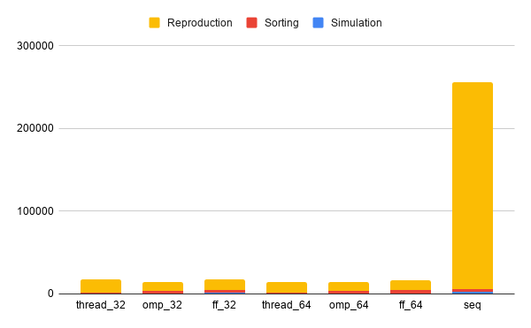

# PGA
A framework for implement genetic algorithm with parallel programming. This framework is implemented with  Header only so you just have to include the Heaaders file. 

There are three different parallel version. One based on native thread, one on openmp and one on fast flow. 
## Usage
The library is bilt around two objects. The Agent and the Population. An Agent depends on the task you are going to face. You have to inherit the abstract class `pga/Agent.h` and override these two methods:

`simluate()`: With this funciton you should update the fitness in respect to the DNA of the agent. The fitness will be used later in order to obtain the probability with which the agent will be selected as parent for the new generation. 

`reprudction(Agent, Agent)`: With this function the agent will be recreated given the two parents. Usually The DNA of the child is mixed with the crosover between the DNA of the two parents. In addition there should be some mutation in order to avoid local optima.

Of corse many other variables and method should be add in order to implement the agent for the task, like the DNA and the mutation.

The second object is the `pga/Population.h` which has three derived classes which implements the parallel versions `pga/ff_population_farm2.h`, `pga/omp_population.h` and `pga/thread_population.h`. these objects implement the logic needed for the training, calling the simulation, sorting the agentm keeping the best from the previus generation and generating a new population with the reproduction. It is implemented as a template. 

## Example
This framewrok was tested with the tsp problem. you can find the working example on the tsp directory.

## Performance

I deeply tested the framework even with a 256 cores server.

You can see here how well it performs (20x faster than the sequential version with only 32 threads) even if this task's simulation phase takes a small amount of time, therefore even better performance are easly achivable. 

## Contributions
Many interesting additional features could be added as well as support for new tasks. It would be great you add somenthing. Enjoi 
